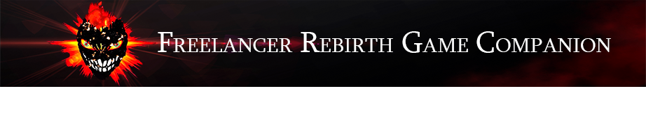

✨Dvurechensky✨

    

<h1 align="center"> Помощник игры Freelancer Rebirth 😈</h1>

    

    
    

  <strong>🌐 Язык: </strong>
  
  
    ✅ 🇷🇺 Русский (текущий)
  
  | 
  <a href="./README.md" style="color: #0891b2; margin: 0 10px;">
    🇺🇸 English
  </a>

---

> [!NOTE]
> Этот проект является частью экосистемы **Lizerium** и относится к направлению:
>
> - [`Lizerium.Software.Structs`](https://github.com/Lizerium/Lizerium.Software.Structs)
>
> Если вы ищете связанные инженерные и вспомогательные инструменты, начните оттуда.

# ✨ Оглавление

- [✨ Оглавление](#-оглавление)
  - [🔮 Описание](#-описание)
  - [🔮 Возможности](#-возможности)
  - [🔮 Требования](#-требования)
  - [👋 Важно](#-важно)

## 🔮 Описание

> Version 2.0. Работает стабильно на моде Freelancer Rebirth 7.7

- Сайт проекта над которым я поработал в своё время [Freelancer Rebirth](http://freelancerothe.ucoz.ru/)

## 🔮 Возможности

1. Показывает в системах: Все порталы, контейнеры, базы
2. Строит и визуализирует маршрут от системы до системы.
3. Может найти местоположение предметов в контейнерах и в астероидных полях.

## 🔮 Требования

- Visual Studio 2022
- Положить в корень приложения папки **SYSTEMS**, **ASTEROIDS**, файлы **universe.ini**, **loadouts.ini**
- Положить в корень приложения **DLL** файлы: **nameresources.dll**, **SBM.dll**, **SBM2.dll**, **SBM3.dll**
- Также требуется извлечь файлы из программы **FLStat** (Выгрузка для БД):

1. **equipments.ini**: в формате - **3, 4, 534954, 0, orchid_st_torpedo_ammo, Торпеда, 1000, 0.00, 0, 0** **systems.ini**
2. **systems.ini**: в формате - **start01=Пенсильвания**

## 👋 Важно

- MyFLStat.sql - файл соддержит в себе всю необходимую информацию - для изъятия информации в нужном виде используйте Notepad++
- В папке **Resources** лежит **FLStat**

    

<h1 align="center">Как это выглядит?👨🏽‍💻</h1>

    

✨Dvurechensky✨

